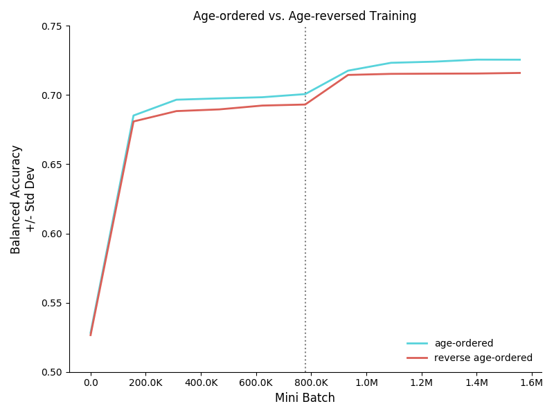

# Starting-Small

The goal of this repository is to demonstrate that language input ordered by age of the child improves category learning in a simple RNN trained to predict child-directed speech.
It contains code to train RNNs on age-ordered and age-reversed child-directed speech.
This project exists for reference and replication only, and is not designed to be used for further development.
To that end, most of the complexity of the original project have been stripped.  

## Motivation & Results

Theoretical motivation and detailed analyses of the results can be found in Philip Huebner's master's thesis, submitted in August 2019.
The thesis will become available on his [personal website](http://philhuebner.com) in early 2020.

## Training Data

The training input consists of transcribed child-directed speech from the CHILDES database.
The text used to train the RNN in my thesis is available in `data/childes-20180319.txt`. 
It was created using [CreateCHILDESCorpus](https://github.com/UIUCLearningLanguageLab/CreateCHILDESCorpus), which performs:

1) tokenization using the default tokenizer in `spacy`
2) lowercasing
3) ordering of transcripts by the age of the target child

## Installation

First, create a new virtual environment for Python 3.6. Then:

```
pip install git+https://github.com/UIUCLearningLanguageLab/StartingSmall
```

## Dependencies

To install all the dependencies, execute the following in your virtual environment: 

```bash
pip install -r requirements.txt
```

### Preppy 1.0.0

The text files are prepared for training using a custom Python package `Preppy`.
It is available [here](https://github.com/phueb/Preppy).
It performs no reordering of the input, and assumes instead that the lines in the text file are already in the order that they should be presented to the model.

### CategoryEval 1.0.0

Evaluation of semantic category knowledge requires the custom Python package `CategoryEval`.
It is available [here](https://github.com/phueb/CategoryEval).
It computes how well the model's learned representations recapitulate some human-created gold category structure.
By default, it returns the balanced accuracy, but F1 and Cohen's Kappa can be computed also.

### Ludwig 1.3.0

If you are a member of the UIUC Learning & Language lab, you can run the jobs in parallel on multiple machines.
This is recommended if multiple replications need to be run, or if no access to GPUs is otherwise available.

## Usage

### Training

The code is designed to run on multiple machines, at the UIUC Learning & Language Lab using a custom job submission system called [Ludwig](https://github.com/phueb/Ludwig).
If you have access to the lab's file server, you can submit jobs with `Ludwig`:

```bash
ludwig -e PATH-TO-PREPPY PATH-TO-CATEGORYEVAL
```

Alternatively, the experiment can be run locally:

```bash
ludwig --local
```

To ensure, no access to the lab's server is attempted:

```bash
ludwig --local --isolated
```

### Plot results

To plot a summary of the results:

```bash
python3 analysis/plot_summary.py
```



## History

### 2016-2018
Initial work began in 2016, at the University of California, Riverside, under the supervision of Prof Jon Willits.

### 2019
In an effort to simplify the code used in this repository, a major rewrite was undertaken in October 2019.
The code was ported from tensorflow 1.12 to pytorch.
The following changes resulted due to the porting:
* the custom RNN architecture was replaced by a more standard architecture. 
Specifically, prior to October 2019, embeddings were directly added to the hidden layer.
In the standard RNN architecture, embeddings undergo an additional transformation step before being added to the hidden layer.
However, the key finding, that age-ordered training improves semantic category learning, replicated in this new architecture.

## Compatibility

Developed on Ubuntu 16.04 with Python 3.6
